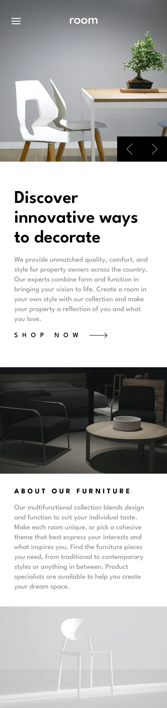
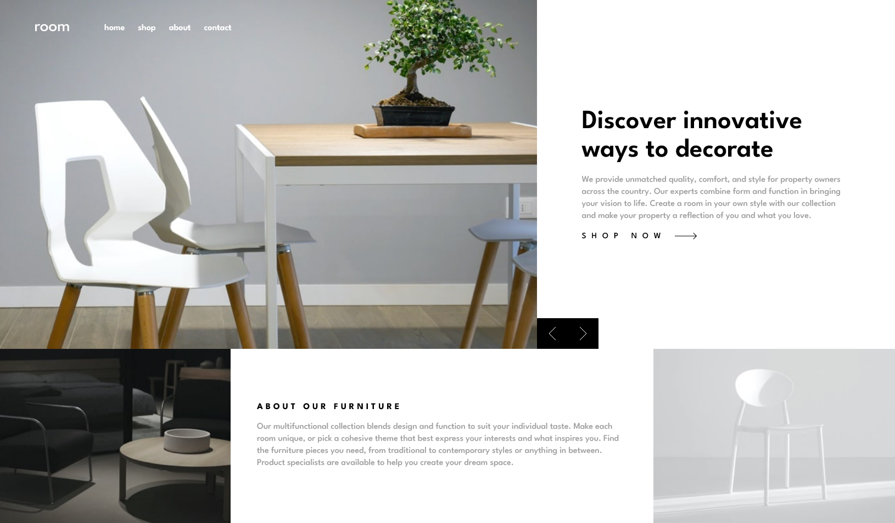

# Frontend Mentor - Room homepage solution

This is a solution to the [Room homepage challenge on Frontend Mentor](https://www.frontendmentor.io/challenges/room-homepage-BtdBY_ENq). Frontend Mentor challenges help you improve your coding skills by building realistic projects.

## The challenge

Users should be able to:

- View the optimal layout for the site depending on their device's screen size
- See hover states for all interactive elements on the page
- Navigate the slider using either their mouse/trackpad or keyboard

## Screenshot

## Links

- Solution URL: [Frontend Mentor Solution Page](https://www.frontendmentor.io/solutions/room-homepage-mbvDGirXCO)
- Live Site URL: [GitHub Pages Site](https://karolbanat.github.io/room-homepage/)

### Useful resources

- [MDN docs](https://developer.mozilla.org/en-US/docs/Web/API/Element/keydown_event) - For navigating slider with keyboard arrows
- [Stack Overflow](https://stackoverflow.com/questions/2264072/detect-a-finger-swipe-through-javascript-on-the-iphone-and-android), [MDN docs](https://developer.mozilla.org/en-US/docs/Web/API/Element/touchstart_event), [MDN docs](https://developer.mozilla.org/en-US/docs/Web/API/Element/touchend_event) - For simple swipe detection

## Author

- Frontend Mentor - [@karolbanat](https://www.frontendmentor.io/profile/karolbanat)
